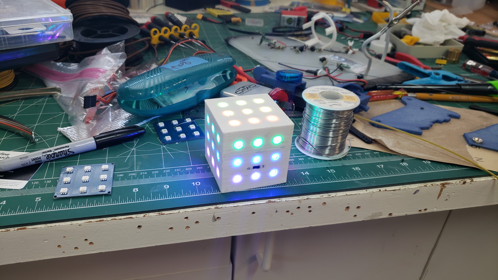
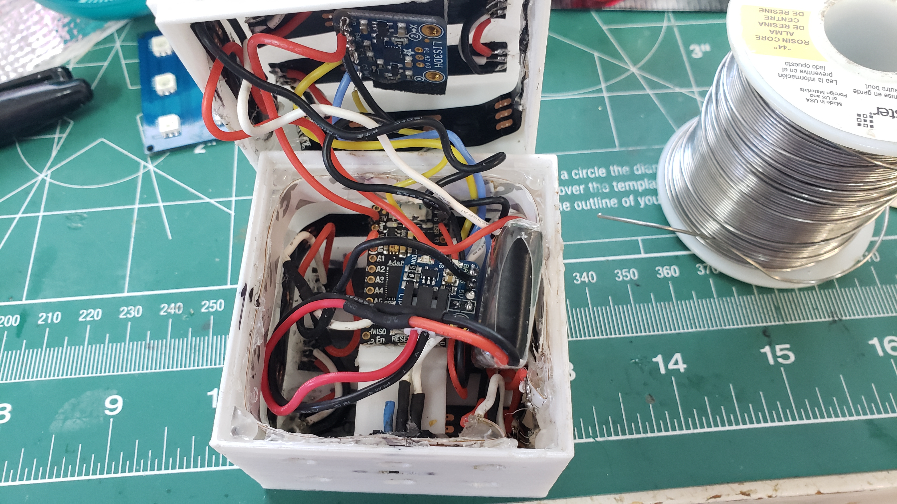

# LED Cube V1
Arduino LED Cube

This is code and descriptions of the process I have gone through to create an LED Cube. The LED is very useful for
understanding basic CS concepts and I beleive could be very useful in computer science education for youger audiences.
Also the LED Cube is just cool. With a good comprehension of hardware and coding you can do alot of things with 54
individually adressable LEDs.

Due to lack of documentation on my parts I dont have any pictures of the build process but you should be able to tell from the final product that it was not easy.

## LED
Here is a pic of the final product

And here is the insides...ya its not pretty, and thus why this is Version 1

