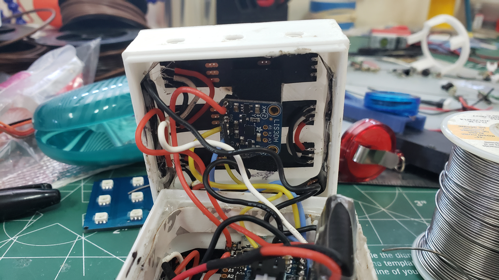

# LED Cube V1
Arduino LED Cube

This is code and descriptions of the process I have gone through to create an LED Cube. The LED is very useful for
understanding basic CS concepts and I believe could be very useful in computer science education for younger audiences.
Also the LED Cube is just cool. With a good understanding of hardware and coding you can do a lot of things with 54
individually addressable LEDs.

Fusion 360 Dynamic Link to CAD --> https://a360.co/2GVcFAf

Due to lack of documentation on my part I don't have any pictures of the build process but you should be able to tell from the final product that it was not easy.

## Build
Here is a pic of the final product

And here is the insides...ya it's not pretty, and thus why this is Version 1

- The LED Cube consists of a 3D printed shell with 2 halfs
- Inside that shell is strips of LEDs stranded together and glued down, you can see in this pic how they were laid down

- There is a tray that holds a Pro Trinket board with code running all of the light functions and controls for the MPU
- There is also a battery pack with a piggy back on the Trinket board for charging
- The outside of the cube has a hole for charging and accessing the Trinket board, as well as a switch for on/off\

My favorite part of the cube is the accelerometer which you can see in the top half of the first picture, it lets me use tap commands to switch between light functions which makes the cube overall much more enjoyable to use. I coded it to use double taps to go to the next light function.

## Educational Use
I have used this cube to help teach students about 1D/2D arrays. It really helps students visualize what 2D arrays actually are and how they can use them in their own projects. Just lettings students make functions for this cube helps them understand the physicality of arrays.

## Known Issues
If you leave it on long enough it will start to do very weird things. I am pretty sure this is due to the log information getting pushed. If you modified the code and got rid of all the serial printing I believe this would be resolved.

